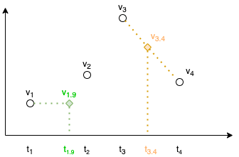

# py(ar)chiver

A python package providing a wrapped utility service:
- **For archived data access** in the *EPICS Archiver*.
  - Simple **data extraction** for scalars and waveforms,
  - **Auto search for the last value** if not found in the requested time window,
  - Some tools are provided for **data processing**  like data aligning, moving average or data source (PVs) status checks.
  - Comparison of boolean signals, see more in [BOOLEAN.md](BOOLEAN.md)
- **For saved configurations and snapshots** in the EPICS *SaveAndRestore*, see more in [SAVEANDRESTORE.md](SAVEANDRESTORE.md)
- Extended **waveform support** with collectors for both: archiver and realtime subscriptions, see more in [WAVEFORM.md](WAVEFORM.md)
> **NOTE**: Check folder `examples`, where interactive notebooks and `cli` scripts are.

## Examples on *Archiver* utility classes in nutshell

To set up the client, all one needs is the following call:
```python
from pychiver.archiver import Archiver
archiver = Archiver(archiver_url='http://archiver-01.tn.esss.lu.se')
```
Specify what and from when is going to be extracted
```python
start = "2021-06-17 18:00:00"
end = "2021-06-20 12:00:00"
pvs = ("RFQ-010:RFS-Kly-110:Oil-Tmp", "RFQ-010:RFS-Kly-110:Coll-WtrC-Flw")
```

### Get PVs data

Regardless if requested PV is a scalar or a waveform:
```python
data = archiver.get(pvs, start_date=start, end_date=end)
# returns dict of PV -> DataFrame
```

```python
data[pvs[0]].head()
         secs       val      nanos  severity  status          status_label  \
0  1626437406  0.999994  754566219         0       0  EpicsStatus.NO_ALARM   
1  1626437522  1.999987  787428386         0       0  EpicsStatus.NO_ALARM   
2  1626437528  0.999994  805362607         0       0  EpicsStatus.NO_ALARM   
3  1626437652  1.999987  996693166         0       0  EpicsStatus.NO_ALARM   
4  1626437673  3.999975   16029357         0       0  EpicsStatus.NO_ALARM   

           severity_label    secs_nanos                          time  
0  EpicsSeverity.NO_ALARM  1.626437e+09 2021-07-16 12:10:06.754566144  
1  EpicsSeverity.NO_ALARM  1.626438e+09 2021-07-16 12:12:02.787428352  
2  EpicsSeverity.NO_ALARM  1.626438e+09 2021-07-16 12:12:08.805362688  
3  EpicsSeverity.NO_ALARM  1.626438e+09 2021-07-16 12:14:12.996693248  
4  EpicsSeverity.NO_ALARM  1.626438e+09 2021-07-16 12:14:33.016029440  
```

*EPICS* Severity and Status (`pychiver.codes`) exist both the raw, and the translated version.

> **NOTE** if no value is found in the requested window (i.e. value did not change, 
> therefore its last state maybe saved some time before the requested window) an automatic attempt
> for the last 24h (configurable) will be performed.

### Get PVs and align them together
To get many PVs at the same time and additionally perform their 'time' alignment use:
```python
data = archiver.getAligned(pvs, start_date=start, end_date=end)
#returns one combined pandas DataFrame with all PVS aligned to the desired time_base
```
There is a parameter defining the interpolation strategy used when aligning (see `pychicer.calculations`). 
The following image depicts the two available implementations: 
- `LinearInterpolationStrategy` (*default*, shown in orange) 
- `LastAcquiredValueInterpolationStrategy` (shown in green)



> **NOTE**: this will only work for scalars! An exception will be thrown if you will mix waveforms and scalars

### Get PV Status

A call that checks if requested PV is being archived.

```python
data = archiver.check("RFQ-010:RFS-Kly-110:Oil-Tmp")
```
 > **Note**: this is called internally for every call you make, an empty dataframe is returned, and a warning is printed.
```python
{'RFQ-010:RFS-Kly-110:Oil-Tmp': {'lastRotateLogs': 'Never',
  'appliance': 'archiver-01',
  'pvName': 'RFQ-010:RFS-Kly-110:Oil-Tmp',
  'pvNameOnly': 'RFQ-010:RFS-Kly-110:Oil-Tmp',
  'connectionState': 'true',
  'lastEvent': 'Jun/24/2021 19:35:05 +02:00',
  'samplingPeriod': '0.07',
  'isMonitored': 'true',
  'connectionLastRestablished': 'Never',
  'connectionFirstEstablished': 'Jun/21/2021 12:20:38 +02:00',
  'connectionLossRegainCount': '0',
  'status': 'Being archived'}}
```


## TimeStamp Format
*pychiver* supports the following formats:
1) as `datetime` objects, eg:  `datetime.now()`, `datetime.strptime('2021-02-28 13:13:13', DATE_FORMAT)`
1) as plain text e.g. `'2021-02-28 13:13:13'`, following the format `%Y-%m-%d %H:%M:%S`


# Installation

From the ESS artifactory:

```commandline
pip install pychiver
```

## Extra environmental configuration
Setup of the environmental variable is possible, the following can be set for the desired instance
 - `EPICS_ARCHIVER_URL` 
 - `SAVE_AND_RESTORE_URL`


