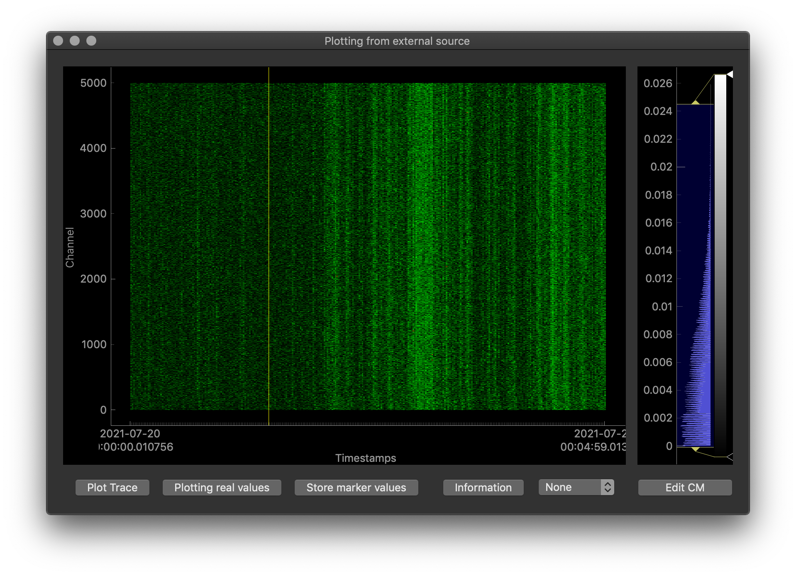

# pychiver for WAVEFORM support

There are few implementations available for waveform collectors:
* `PVWaveformCollector` Real time EPICS (camonitor) collector, to be set up with one PV, a raw waveform is collected
  and kept in the data buffer
* `ManyPVSWaveformCollector`, when there is a need for many PVs(scalar!) to be followed, this collector allows to listen to the waveform PV, collect its average value in ROI, and keep it in the data buffer.
  Exposed dataframe contains a timeseries waveform that is build from individual PV's values.
* `ArchiverWaveformCollector`, similar to the `PVWaveformCollector` but for the Archived data collector.

Both provide convenience methods for treating waveforms, their running scalar representations, Region of Interest (ROI) configuration etc.

One can visualise the data combining the collectors with the `spec2d` [package](git link)


```python
# main collector's return point
print(aCollector.getAllWaveforms())

# to get only the last collected waveform
print(aCollector.getLastWaveform())

# only trace of the average value defined in RegionOfInterest if that is set
print(aCollector.getROITrace())
# NOTE: this is a shortcut to pvCollector.getAllWaveforms()[['time','val_roi']]
```

### ROI configuration
One can configure ROI either at the constructor time:
```python
aCollector = ArchiverWaveformCollector( ..., roi_indexes=(1,10))
```
or later in the code, more dynamically:
```python
aCollector.updateROI(roi_indexes=(1,10))
```
> **NOTE** ROI definition is by the sample index! I.e. in the example above the average of the waveform will be calculated between the 1st, and the 10th sample

## Example: Archived Data PV collector

```python
start_time = "2021-06-25 12:00:00"
end_time = "2021-06-25 14:30:00"
PV = "RFQ-010:RFS-Kly-110:PwrFwd-Wave-PM"

from pychiver.waveform import ArchiverWaveformCollector
aCollector = ArchiverWaveformCollector(PV=PV,
                                       start_date=start_time,
                                       end_date=end_time,
                                       archiver_url='http://archiver-01.tn.esss.lu.se')

print(aCollector.getAllWaveforms())
```


## Example: Real-time PVWaveform Collector

One can include part the following part of the code in some 'live display tools' and have it updated at desired refresh rate.

```python
from time import sleep
from pychiver.waveform import PVWaveformCollector

PV = "RFQ-010:RFS-Kly-110:PwrFwd-Wave-PM"

def update_plot_callback(**kwargs):
    print("------ ({}) ------".format(kwargs.get('lastCheck')))
    print(kwargs.get('dataframe'), sep='\n')
    # NOTE: kwargs.get('dataframe') == pvCollector.getAllWaveforms()

pvCollector = PVWaveformCollector(PV=PV,
                                  callback=update_plot_callback,
                                  callback_delay_in_seconds=2)

while True:
    sleep(0.1)
    if timeConditionForElapsed10s:
        # on top of the 2s refresh from the callback, every 10s this will be called
        print(pvCollector.getAllWaveforms())

```
